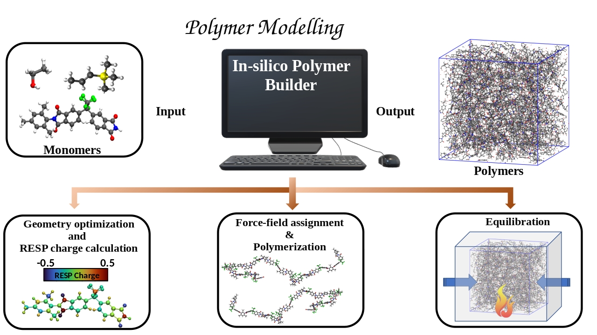

# Polymer
[](http://opensource.org/licenses/MIT)
<p align="center">
  
</p>
A Python-based interface for generating customizable polymer structures. This tool allows you to define monomer units, polymerization parameters, and chain architectures, facilitating seamless integration with molecular simulation workflows. Ideal for creating complex polymer systems for computational material science.

# Python Script for Optimizing Monomers and Building Polymers

This script performs the following tasks:
1. Optimizes a monomer's geometry using Psi4.
2. Calculates ESP and RESP charges.
3. Builds a polymer using Pysimm.
4. Please install [Pysimm_by_SN](https://github.com/supriyonaskar/Pysimm_by_SN.git) from my repository and install it to run this code and add the below lines to your bashrc file.
- export LAMMPS_EXEC=path_to_your/lmp_mpi
- export PYTHONPATH=$PYTHONPATH:/path_to_your/pysimm
- export PATH=$PATH:/path_to_your/bin
- export ANTECHAMBER_EXEC=~/path_to_your/antechamber
5. The script requires AMBER Tools to run. You can download and install it from [AMBER's official site](https://ambermd.org/).


## Prerequisites

### Required Python Modules
- `numpy`
- `math`
- `mdtraj`
- `pysimm`
- `psi4`
- `resp`
- `pandas`

### Required Files
- `input_parameters.dat`: This file should have 7 columns:
  1. Index of the monomer's head atom (index starts from 1).
  2. Index of the monomer's tail atom.
  3. Hydrogen attached to the head atom of the monomer.
  4. Hydrogen attached to the tail atom of the monomer.
  5. Name of the molecule (Ensure the initial XYZ file of the monomer has the name format `{molecule_name}_initial.xyz` and contains two remark lines at the beginning).
  6. Flag to keep (0) or remove (1) unnecessary files during execution.
  7. Optimization flag: 
      - 1: Optimize and prepare the polymer.
      - 0: Only build the polymer without optimizing.

### Input Structure
- `{molecule_name}_initial.xyz`: Initial monomer structure (from Avogadro or another tool).

## Key Steps

1. **Geometry Optimization:**
   - Uses Psi4 with the `scf/cc-pVDZ` method.
   - Produces optimized geometry in `{molecule_name}_optimized.xyz`.

2. **RESP Charge Calculation:**
   - Conducts ESP and RESP charge fitting.
   - Outputs charges in the `.mol2` file format for Pysimm.

3. **Polymer Building:**
   - Builds a polymer using Pysimm's random walk algorithm.
   - Caps polymers with hydrogen atoms if necessary.
   - Minimizes the polymer structure.
   - Outputs polymer configurations in `.lmps` format.

## Usage

### Execution Steps
1. Prepare the `input_parameters.dat` file and `{molecule_name}_initial.xyz` file.
2. Run the script:
   ```bash
   python script_name.py
   ```

### Example: Input Parameters
```
### Input parameters for polymer building ###
#1. Index of head atom of the monomer (index starts from 1)
#2. Index of the tail atom of the monomer 
#3. Hydrogen attached to the head atom of the monomer
#4. Hydrogen attached to the tail atom of the monomer
#5. Name of the molecule (You should remember that your initial xyz file of the monomer should have a name like {moleculename}_initial.xyz), also make sure xyz file have two remarks like in begining. 
#6. To remove files set it to 1. To keep make it 0
#7. Flag to optimize or not, if 1 it will optimize, if 0 it will build the polymer...else not
### Sometimes, you may not have some parameters in your force-field database, then you have to modify gaff.json to include those. 


21
38
26
40 
SPEEK
0 
1
```

## Notes
- The script modifies the `gaff.json` file for force-field parameters if required.
- Ensure sufficient memory and threads for Psi4:
  ```python
  psi4.set_memory('100 GB')
  psi4.set_num_threads(20)
  ```

### Troubleshooting
- If force-field parameters are missing, update `gaff.json` accordingly.
- Ensure the input XYZ file is properly formatted.

---

### Written by:
**Supriyo Naskar**
Institute: ICGM, CNRS, ENSCM, University of Montpellier
